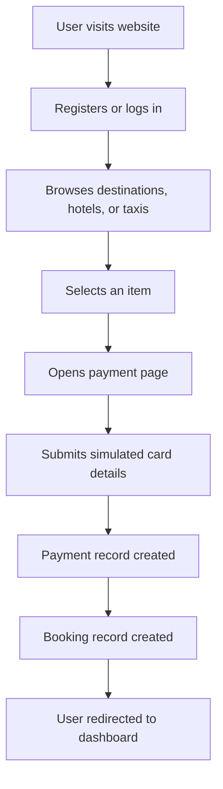
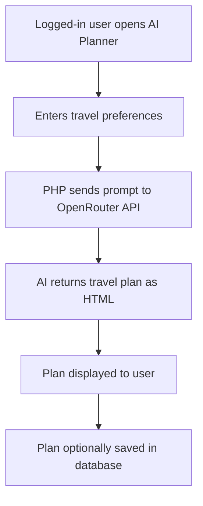
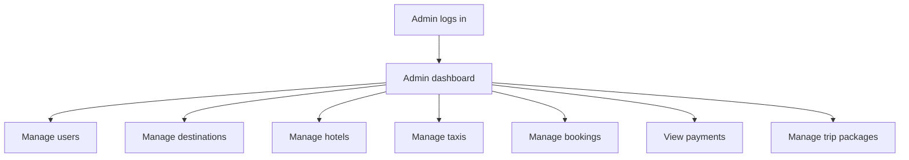

# GLOBEXA Project Analysis Document

## 1. Project Overview

**GLOBEXA** is an AI-powered travel planning and management system built as a classic PHP and MySQL web application. The project is designed to run in a local XAMPP environment and provides travel-related features such as destination browsing, hotel booking, taxi booking, trip package planning, payments, user dashboards, and admin management.

The application also includes an AI travel planner that connects to the OpenRouter API to generate personalized travel itineraries based on user input.

---

## 2. Technology Stack

| Area | Technology Used |
|---|---|
| Backend | PHP |
| Database | MySQL |
| Database Access | PDO |
| Frontend | HTML, CSS, JavaScript |
| Styling | Custom CSS, Font Awesome, Google Fonts |
| AI Integration | OpenRouter API |
| Local Server | XAMPP |

The project does not use Composer, Node.js, npm, Laravel, React, or any other external build framework. It is a plain multi-page PHP application.

---

## 3. Project Structure

```text
Globxa/
├── admin/
│   ├── bookings.php
│   ├── dashboard.php
│   ├── destinations.php
│   ├── hotels.php
│   ├── login.php
│   ├── payments.php
│   ├── taxis.php
│   ├── trips.php
│   └── users.php
│
├── assets/
│   ├── css/
│   │   ├── responsive.css
│   │   └── style.css
│   ├── images/
│   └── js/
│       └── script.js
│
├── database/
│   └── globexa.sql
│
├── includes/
│   ├── auth.php
│   ├── db.php
│   ├── footer.php
│   └── header.php
│
├── ai_planner.php
├── book_trip.php
├── bookings.php
├── contact.php
├── dashboard.php
├── destinations.php
├── hotels.php
├── index.php
├── login.php
├── logout.php
├── package_checkout.php
├── payment.php
├── profile.php
├── register.php
├── taxi.php
├── view_trip.php
└── readme.md
```

---

## 4. Main Features

### 4.1 User Features

The user side of the system allows customers to:

- Register for an account
- Log in and log out
- Browse destinations
- Search for travel destinations
- View hotels
- Book hotels
- Book taxis
- Use an AI travel planner
- Book complete trip packages
- Make simulated payments
- View booking history
- Manage profile information
- Contact support

### 4.2 Admin Features

The admin panel allows administrators to:

- Log in as admin
- View dashboard statistics
- Manage users
- Manage destinations
- Manage hotels
- Manage taxi services
- Manage bookings
- View payments and revenue
- Manage trip packages

---

## 5. Important Files

### `includes/db.php`

This file handles the database connection using PDO. It defines database credentials and creates the `$pdo` object used throughout the application.

It also currently contains the OpenRouter API key.

### `includes/auth.php`

This file manages session-based authentication. It includes helper functions such as:

- `isLoggedIn()`
- `isAdmin()`
- `redirectIfNotLoggedIn()`
- `redirectIfNotAdmin()`

### `includes/header.php`

This file contains the common website header and navigation menu used by public pages.

### `database/globexa.sql`

This file contains the database schema and sample seed data for users, destinations, hotels, taxis, flights, bookings, payments, and trip packages.

### `ai_planner.php`

This page allows logged-in users to enter travel preferences and receive an AI-generated itinerary from the OpenRouter API.

### `book_trip.php`

This page handles a more advanced trip booking flow. It can generate an AI plan and lets users choose flights, hotels, taxis, and package details.

### `payment.php`

This page simulates payment processing and creates records in the `payments` and `bookings` tables.

---

## 6. Database Tables

The project uses the following main database tables:

### `users`

Stores user and admin account information.

Important fields:

- `id`
- `name`
- `email`
- `phone`
- `password`
- `role`
- `created_at`

### `destinations`

Stores destination information.

Important fields:

- `id`
- `title`
- `country`
- `image`
- `description`
- `price`

### `hotels`

Stores hotel records.

Important fields:

- `id`
- `name`
- `location`
- `image`
- `price`
- `rating`

### `taxis`

Stores taxi service information.

Important fields:

- `id`
- `driver_name`
- `car_name`
- `location`
- `price`

### `bookings`

Stores user bookings.

Important fields:

- `id`
- `user_id`
- `type`
- `item_id`
- `total_price`
- `status`
- `created_at`

### `payments`

Stores payment records.

Important fields:

- `id`
- `user_id`
- `amount`
- `payment_method`
- `transaction_id`
- `status`
- `created_at`

### `flights`

Stores available flight options.

Important fields:

- `id`
- `airline`
- `flight_number`
- `departure_city`
- `arrival_city`
- `departure_time`
- `arrival_time`
- `price`
- `class`
- `image`

### `trip_packages`

Stores complete trip package bookings.

Important fields:

- `id`
- `user_id`
- `destination`
- `travel_date`
- `return_date`
- `travelers`
- `budget`
- `ai_plan`
- `flight_id`
- `hotel_id`
- `taxi_id`
- `total_price`
- `status`
- `created_at`

---

## 7. Application Flow

### 7.1 User Booking Flow



### 7.2 AI Planner Flow



### 7.3 Admin Flow



---

## 8. Strengths of the Project

- The project has a clear travel booking theme.
- It includes both user and admin panels.
- The database schema is included with sample data.
- Passwords are stored using PHP password hashing.
- Many SQL operations use prepared statements through PDO.
- The UI is modern and visually attractive.
- The application includes an AI-powered travel planning feature.
- Admin dashboard provides useful statistics such as users, bookings, and revenue.
- The system is easy to run locally using XAMPP.

---

## 9. Issues and Weaknesses

### 9.1 Hardcoded API Key

The OpenRouter API key is stored directly in `includes/db.php`. This is a major security risk. API keys should not be committed in source code.

Recommended solution:

- Revoke the exposed key.
- Store the key in an environment variable or local config file.
- Exclude secret config files using `.gitignore`.

### 9.2 SSL Verification Disabled

Some API requests disable SSL certificate verification using:

```php
CURLOPT_SSL_VERIFYPEER => false
```

This weakens HTTPS security and should be removed.

### 9.3 No CSRF Protection

Forms do not use CSRF tokens. This affects login, registration, payments, bookings, and admin actions.

Recommended solution:

- Add CSRF token generation in the session.
- Add hidden CSRF fields to forms.
- Validate tokens before processing POST requests.

### 9.4 Simulated Payment System

The payment system accepts card details directly and immediately marks the payment as completed. This is acceptable for a demo project, but it should not be used for real payments.

Recommended solution:

- Use a real payment gateway such as Razorpay, Stripe, or PayPal.
- Do not store or directly process card details.

### 9.5 Runtime Table Creation

Some pages create database tables during page execution. This is convenient for development but not ideal for production.

Recommended solution:

- Move all schema creation into SQL migration files.
- Keep database setup inside `database/globexa.sql` or a migration system.

### 9.6 Debug/Test Files in Root Directory

Files such as `test.php`, `test_api.php`, `test_api2.php`, `test_api3.php`, `test_api4.php`, `test_api5.php`, and `diag.php` are present in the project root.

Recommended solution:

- Remove them before deployment.
- Move development-only files to a private tools directory if needed.

### 9.7 AI HTML Rendering Risk

The AI planner asks the AI provider to return HTML, which is then displayed to users. If not sanitized, this can create an XSS risk.

Recommended solution:

- Sanitize AI-generated HTML before rendering.
- Allow only safe tags such as `<p>`, `<ul>`, `<li>`, `<strong>`, and headings.

### 9.8 No Framework or Central Routing

The project uses separate PHP files for each page. This works for small systems, but as the project grows, maintenance becomes harder.

Recommended solution:

- Use shared helper functions.
- Organize code into controllers, models, and views.
- Consider migrating to a framework such as Laravel for a larger version.

---

## 10. Security Recommendations

Recommended improvements before production deployment:

1. Revoke and replace the exposed OpenRouter API key.
2. Move secrets to environment variables.
3. Disable public error display.
4. Enable proper error logging.
5. Remove test and diagnostic files from the public root.
6. Add CSRF protection to all POST forms.
7. Sanitize all AI-generated HTML before display.
8. Keep SSL verification enabled.
9. Add stronger validation for all user inputs.
10. Use a real payment gateway for actual payments.
11. Add proper access control to all admin pages.
12. Add rate limiting for login and AI planner requests.

---

## 11. Suggested Future Enhancements

- Add password reset functionality.
- Add email notifications for bookings.
- Add booking cancellation and refund handling.
- Add advanced destination filtering.
- Add reviews and ratings for hotels and destinations.
- Add real payment gateway integration.
- Add real flight/hotel APIs.
- Add PDF invoice generation.
- Add admin charts and analytics.
- Add multi-language support.
- Add automated tests.
- Add a cleaner MVC folder structure.

---

## 12. Overall Conclusion

GLOBEXA is a functional academic/demo travel management system with a good set of user and admin features. It demonstrates PHP, MySQL, authentication, booking management, payment simulation, and AI-powered travel planning.

The application is suitable for project presentation and local demonstration. However, before real-world deployment, it requires important security improvements, especially around secret management, CSRF protection, payment handling, debug file removal, and sanitization of AI-generated content.
